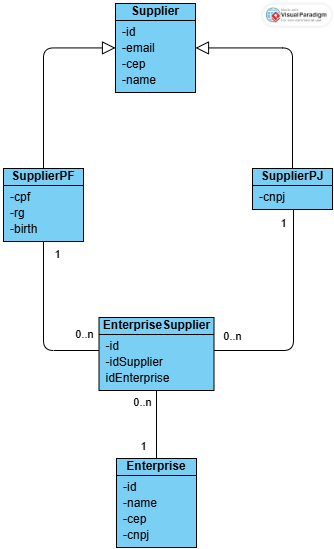

# 📌 Technical Test – CRUD de Empresas e Fornecedores

Este projeto consiste em um sistema completo com backend em Spring Boot e frontend em React + TypeScript, utilizando Axios e Zustand.
Toda a aplicação é executada via Docker Compose, incluindo banco de dados PostgreSQL.

O backend também faz consulta automática de CEP usando a API pública ViaCEP durante o cadastro e atualização de empresas/fornecedores.

# 📦 Tecnologias utilizadas
## - Backend
- Java 17
- Spring Boot
- Spring Web
- Spring Data JPA
- Lombock
- Swagger
- Flyway
- PostgreSQL
- Validações
- Integração com ViaCEP

## - Frontend
- React com Next.js
- TypeScript
- Axios
- Zustand (state management)
- TailwindCSS

## - Infra
- Docker
- Docker Compose

# 📄 Modelo de Classes
  
  
  
# 🚀 Como rodar o projeto  
  
## 1️⃣ Pré-requisitos

## Certifique-se de ter instalado:

- Docker
- Docker Compose

## Verifique:

```
docker -v
docker compose version
```

## 🔧 Variáveis de ambiente

Crie um arquivo .env na raiz do projeto e copie os dados do arquivo .env.example

## ▶️ Subir todo o ambiente com Docker

Na raiz do projeto (onde está o docker-compose.yml), execute:

```
docker compose up --build
```

Isso irá subir:

- Backend: http://localhost:8080
- Frontend: http://localhost:3000

PostgreSQL rodando nos containers  
Para rodar em background:  
docker compose up -d

# 🧱 Estrutura dos serviços
- Frontend – porta 3000
- Backend – porta 8080
- Aplicação em React + TS + Zustand, consumindo as APIs do backend com axios.
- APIs REST responsáveis pelo CRUD:

    - Empresas
    - Fornecedores

- Validação automática de CEP via ViaCEP
- Database
- PostgreSQL com volume persistente


# 🌐 Doumentação da API via swagger

acesse (http://localhost:8080/swagger-ui/index.html)[http://localhost:8080/swagger-ui/index.html]

Consulta ViaCEP (backend interno) sem endpoint exposto — usado automaticamente nas inserções/atualizações.

# 💻 Scripts úteis
Parar todos os containers:
```
docker compose down
```

Resetar volumes (zerar banco):
```
docker compose down -v
```

# 📁 Estrutura do repositório
/  
├── backend/       # Projeto Spring Boot  
├── frontend/      # Projeto React/Next.js  
└── docker-compose.yml

# 📝 Funcionalidades
✔ CRUD de empresas  
✔ CRUD de fornecedores  
✔ Relação N:N entre empresa e fornecedores com tabela intermediária  
✔ Normalização de tabelas  
✔ Consulta automática de CEP com ViaCEP  
✔ Interface moderna com React + Tailwind  
✔ Gerenciamento de estado com Zustand  
✔ Chamadas HTTP centralizadas com Axios  
✔ Aplicação toda containerizada  
